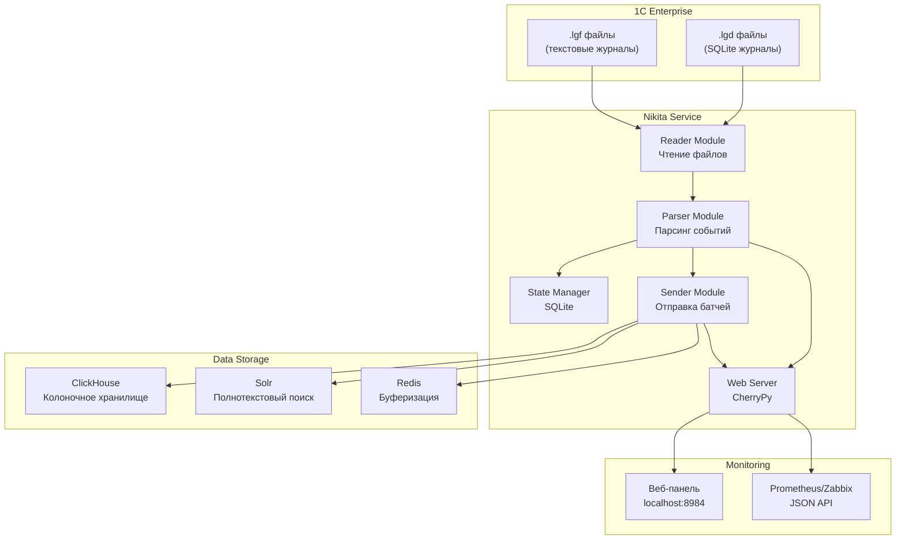
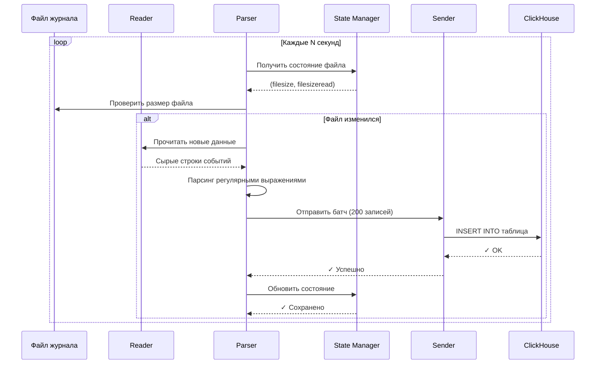
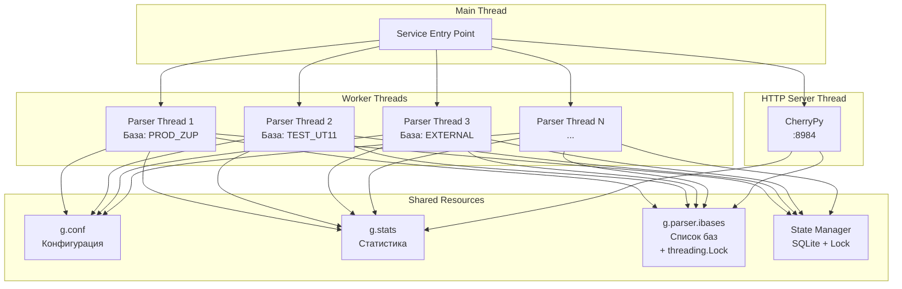
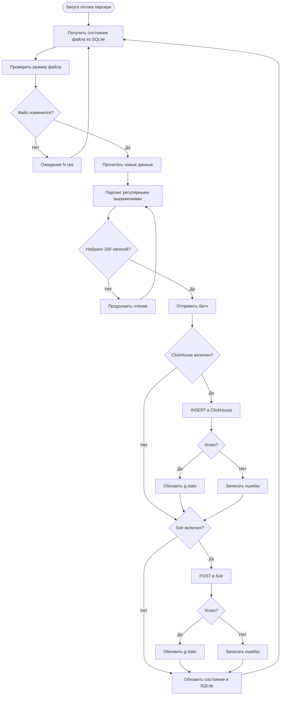
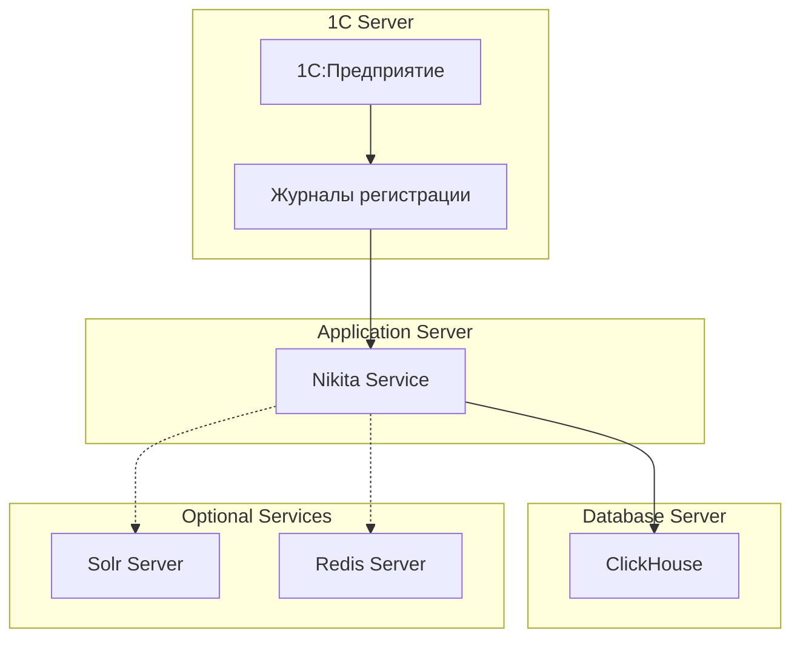

# Архитектура Nikita

Описание архитектуры системы парсинга и экспорта журналов регистрации 1С:Предприятие.

---

## Содержание

- [Общий обзор](#общий-обзор)
- [Архитектурная диаграмма](#архитектурная-диаграмма)
- [Компоненты системы](#компоненты-системы)
- [Поток данных](#поток-данных)
- [Многопоточность](#многопоточность)
- [Хранение состояния](#хранение-состояния)
- [Масштабируемость](#масштабируемость)

---

## Общий обзор

Nikita — это многопоточный сервис, который:
1. **Мониторит** каталоги журналов 1С:Предприятие
2. **Парсит** события из файлов `.lgf` (текстовых) и `.lgd` (SQLite)
3. **Отправляет** данные в хранилища (ClickHouse, Solr, Redis)
4. **Предоставляет** веб-панель мониторинга и JSON API

---

## Архитектурная диаграмма

### Общая архитектура



### Поток данных при парсинге



### Многопоточная архитектура



---

## Компоненты системы

### 1. Entry Point (`Nikita.py`)

**Назначение:** Точка входа, управление жизненным циклом службы.

**Ключевые функции:**
- `start_all()` — запуск всех компонентов
- `stop_all()` — остановка всех потоков
- `nikita_service` (Windows) — класс Windows Service
- Обработка сигналов (Linux daemon)

**Режимы запуска:**
```bash
python Nikita.py console   # Консольный режим (отладка)
python Nikita.py install   # Установка службы (Windows)
python Nikita.py start     # Запуск службы (Windows)
python Nikita.py stop      # Остановка службы (Windows)
python Nikita.py remove    # Удаление службы (Windows)
```

### 2. Globals (`src/globals.py`)

**Назначение:** Глобальная конфигурация и состояние.

**Основные объекты:**
- `g.conf` — параметры из `.env`
- `g.stats` — статистика в реальном времени
- `g.parser` — состояние парсера
- `g.rexp` — скомпилированные регулярные выражения
- `g.ibases_lock` — блокировка для потокобезопасности

**Пример использования:**
```python
from src import globals as g

# Чтение конфигурации
clickhouse_host = g.conf.clickhouse_host

# Обновление статистики
g.stats.clickhouse_total_sent += 200

# Потокобезопасный доступ к списку баз
with g.ibases_lock:
    bases = g.parser.ibases.copy()
```

### 3. Reader (`src/reader.py`)

**Назначение:** Чтение файлов журналов (`.lgf` и `.lgd`).

**Ключевые функции:**
- `reader.read_lgp()` — чтение текстовых журналов `.lgf`
- `reader.read_lgd()` — чтение SQLite журналов `.lgd`
- `reader.trans_id()` — маппинг статусов транзакций

**Форматы:**
- **LGF** — старый текстовый формат (построчный парсинг)
- **LGD** — SQLite база данных (SQL-запросы)

### 4. Parser (`src/parser.py`)

**Назначение:** Основной модуль парсинга и координации.

**Ключевые классы:**
- `lgp_parser_thread` — поток парсера для одной базы 1С

**Ключевые методы:**
- `run()` — основной цикл потока
- `post_query()` — отправка батча в хранилища
- `send_to_clickhouse()` — отправка в ClickHouse
- `send_to_solr()` — отправка в Solr
- `read_ib_dictionary()` — чтение словарей 1С

**Алгоритм работы:**
1. Получить состояние файла из State Manager
2. Проверить размер файла
3. Если файл изменился — прочитать новые данные через Reader
4. Распарсить события регулярными выражениями
5. Сформировать батч (по умолчанию 200 записей)
6. Отправить через Sender
7. Обновить состояние в State Manager
8. Повторять каждые N секунд

### 5. State Manager (`src/state_manager.py`)

**Назначение:** Хранение состояния парсинга в SQLite.

**База данных:** `Nikita.parser.state.db`

**Таблицы:**
- `file_states` — состояние файлов (размер, прочитано)
- `committed_blocks` — история отправленных блоков

**Ключевые методы:**
- `get_file_state(filename, database_name)` — получить состояние файла
- `update_file_state(...)` — обновить состояние
- `log_committed_block(...)` — записать отправленный блок
- `get_total_records_sent(database_name)` — счётчик записей

**Структура file_states:**
```sql
CREATE TABLE file_states (
    database_name TEXT,
    file_basename TEXT,
    filesize INTEGER,
    filesizeread INTEGER,
    PRIMARY KEY (database_name, file_basename)
);
```

### 6. Sender (`src/sender.py`)

**Назначение:** Отправка данных в хранилища.

**Ключевые функции:**
- `send_to_clickhouse()` — вставка в ClickHouse
- `send_to_solr()` — индексация в Solr
- `send_to_redis()` — добавление в очередь Redis

**Особенности:**
- Батчевая отправка (по умолчанию 200 записей)
- Автоматическое создание таблиц в ClickHouse
- Обработка ошибок и повторные попытки
- Логирование с временем выполнения

### 7. Web Server (`src/cherry.py`)

**Назначение:** HTTP-сервер мониторинга (CherryPy).

**Endpoints:**
- `GET /` — веб-панель мониторинга (HTML)
- `GET /stats_api` — JSON API для интеграции

**Данные на панели:**
- Uptime службы
- Статус подключений (🟢/🔴)
- Счётчики отправленных записей
- Последние ошибки
- Список баз 1С с прогрессом

### 8. Tools (`src/tools.py`)

**Назначение:** Вспомогательные функции.

**Ключевые функции:**
- `debug_print()` — потокобезопасное логирование
- `sqlite3_exec()` — выполнение SQL-запросов
- `strtobool()` — парсинг логических значений

---

## Поток данных

### Детальный поток обработки события



---

## Многопоточность

### Модель потоков

Nikita использует **многопоточную модель** с потоком на каждую базу 1С:

```python
# Упрощённый пример
for база in список_баз:
    поток = Thread(target=парсер_функция, args=(база,))
    поток.start()
```

### Потокобезопасность

**Проблема:** Несколько потоков обращаются к общим данным.

**Решение:**
1. **threading.Lock** для критических секций
2. **SQLite** с журналированием WAL
3. **Неизменяемые данные** (конфигурация)

**Примеры:**

```python
# 1. Блокировка для списка баз
with g.ibases_lock:
    bases = g.parser.ibases.copy()

# 2. Блокировка для логирования
with tools.log_lock:
    file.write(message)

# 3. State Manager внутренне использует Lock
state_manager.update_file_state(...)  # Потокобезопасно
```

### Распределение нагрузки

**Автоматическое:**
- По умолчанию создаётся по 1 потоку на базу 1С
- Если баз больше, чем ядер CPU — всё равно по 1 потоку на базу
- Каждый поток работает независимо

**Ручное:**
```ini
# .env
PARSER_THREADS=4  # Ограничить 4 потоками
```

---

## Хранение состояния

### SQLite State Database

**Файл:** `Nikita.parser.state.db`

**Назначение:**
- Запомнить, сколько прочитано из каждого файла
- Продолжить с того же места после перезапуска
- Избежать дублирования данных

**Схема:**

```sql
-- Состояние файлов
CREATE TABLE file_states (
    database_name TEXT NOT NULL,     -- Имя базы 1С
    file_basename TEXT NOT NULL,     -- Имя файла (без пути)
    filesize INTEGER,                -- Полный размер файла
    filesizeread INTEGER,            -- Сколько уже прочитано
    PRIMARY KEY (database_name, file_basename)
);

-- История отправленных блоков
CREATE TABLE committed_blocks (
    id INTEGER PRIMARY KEY AUTOINCREMENT,
    database_name TEXT,
    file_basename TEXT,
    offset_start INTEGER,
    offset_end INTEGER,
    data_records INTEGER,
    committed_at TIMESTAMP DEFAULT CURRENT_TIMESTAMP
);
```

**Пример запроса:**
```python
state = state_manager.get_file_state("/path/to/file.lgp", "База1")
# {'filesize': 1000000, 'filesizeread': 500000}

# Продолжаем чтение с позиции 500000
```

### Миграция состояния

При обновлении с версии 1.x → 2.0:
- Автоматическая миграция старой структуры
- Старые данные сохраняются
- Логируется в `debug/Nikita.*.log`

---

## Масштабируемость

### Вертикальное масштабирование

**Увеличение ресурсов одного сервера:**

1. **CPU:**
   - Увеличьте `PARSER_THREADS` в `.env`
   - Рекомендуется: по 1 потоку на базу 1С

2. **Память:**
   - Увеличьте `SOLR_MEM_MAX` (если используется Solr)
   - Nikita сам потребляет ~200-500 MB

3. **Диск:**
   - Используйте SSD для журналов 1С
   - Используйте SSD для ClickHouse

### Горизонтальное масштабирование

**Несколько экземпляров Nikita:**

**Сценарий:** У вас 100 баз 1С, распределённых по разным серверам.

**Решение:**
1. Запустите Nikita на каждом сервере с 1С
2. Все отправляют в один ClickHouse кластер
3. Каждый экземпляр обрабатывает свои базы

**Пример:**
```
Сервер 1C №1 (20 баз) → Nikita №1 ─┐
Сервер 1C №2 (30 баз) → Nikita №2 ─┼→ ClickHouse кластер
Сервер 1C №3 (50 баз) → Nikita №3 ─┘
```

### Масштабирование ClickHouse

Для больших объёмов данных используйте кластер ClickHouse:
- **Sharding** — распределение данных по серверам
- **Replication** — репликация для отказоустойчивости
- **Distributed таблицы** — прозрачный доступ

См. [ClickHouse Documentation](https://clickhouse.com/docs/ru/engines/table-engines/special/distributed)

---

## Производительность

### Типичные показатели

**Железо:** 4 CPU cores, 8 GB RAM, SSD

| Параметр | Значение |
|----------|----------|
| Баз 1С | 10 |
| События/сек | 1000-5000 |
| Задержка отправки | <50ms (локальный ClickHouse) |
| Потребление CPU | 10-30% |
| Потребление RAM | 200-500 MB |

### Оптимизация

1. **Используйте `.lgd` вместо `.lgf`** — SQLite быстрее текстового парсинга
2. **Локальный ClickHouse** — минимизация сетевой задержки
3. **SSD диски** — быстрое чтение журналов
4. **Отключите Solr** — если не нужен полнотекстовый поиск
5. **Используйте Redis** — буферизация при пиковых нагрузках

---

## Дополнительно

### Диаграмма развёртывания



---

**Обновлено:** 2025-12-11  
**Версия:** 2.0.0

